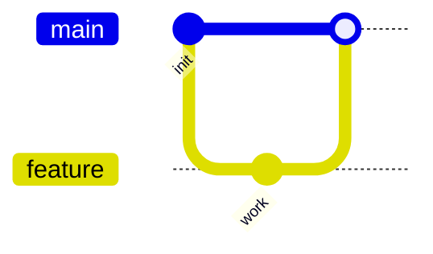

# Markdown 插件使用指南：Markdown All in One + Markdown Preview Enhanced

这份笔记用到的两个 VS Code 插件，以及怎么用它们。装好插件后，用 **Markdown Preview Enhanced (MPE)** 打开 `note.md` 预览，就能看到渲染后的目录、流程图和警示框。

## 一、Markdown All in One

帮你更快地写 Markdown，主要功能：

| 功能 | 做法 |
| --- | --- |
| 生成 / 更新目录 | `Ctrl+Shift+P` → 输入 `Create Table of Contents` |
| 插入标题 | `Ctrl+Shift+1` ~ `Ctrl+Shift+6` 快速插入 H1–H6 |
| 加粗 / 斜体 | `Ctrl+B` / `Ctrl+I` |
| 自动续列表 | 输入 `- ` 或 `1. ` 后回车，自动续行 |
| 一键排版 | 选中文字后 `Ctrl+Shift+P` → `Format Document` |

> 提示：它还会在保存时自动补全 Markdown 的闭合符号（如 `*`、`-` 列表标记），并支持 `Tab` 在列表里缩进。

## 二、Markdown Preview Enhanced (MPE)

比 VS Code 自带预览更强，支持目录、图表、提示框和导出。

| 功能 | 怎么用 |
| --- | --- |
| 打开预览 | 在 `.md` 文件里右键 → `Markdown Preview Enhanced: Open Preview`；或 `Ctrl+Shift+P` 输入 `Open Preview` |
| 自动目录 | 在文件里写 `[TOC]`，预览会自动生成可点击目录 |
| Mermaid 图表 | 用 ` ```mermaid ` 代码块（见 `note.md` 的 branch 流程图） |
| 提示框 / 警示框 | 用 `::: tip` `::: warning` `::: danger` `::: info` 包裹文字 |
| 导出 PDF / HTML | 预览界面里右键 → `Export` |

### 提示框示例

::: tip
这是一个普通提示，蓝色高亮。
:::

::: danger
这是危险 / 警告提示，红色高亮，适合放"别这么做"的内容（比如 `git reset` 的团队警告）。
:::

### Mermaid 示例

````markdown

````

## 三、本笔记用到的特性对照

| 笔记里的写法 | 来自哪个插件 | 作用 |
| --- | --- | --- |
| `[TOC]` | MPE | 自动生成目录 |
| `::: danger ... :::` | MPE | 红色警示框（git reset 的团队警告） |
| ` ```mermaid ` 代码块 | MPE | 渲染 git 分支流程图 |
| 标题层级 / 表格 / 代码块 | Markdown All in One | 规范排版，可用 `Format Document` 整理 |

打开 `note.md`，右键用 MPE 预览，即可看到以上效果。
