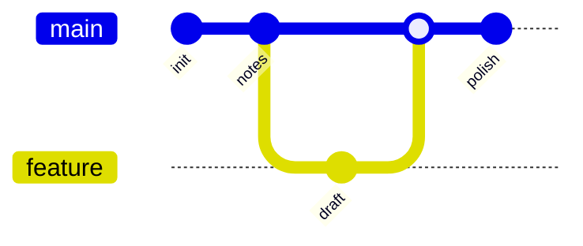

# Git Study Notes

> Personal git learning notes, cleaned up for easier reading.
> Formatted for **Markdown Preview Enhanced** (Mermaid diagrams + callouts) and **Markdown All in One** (headings, lists, tables).

[TOC]

## Commit ID / Hash

- Every commit has an **ID (hash)**.
- There are two forms:
  - **Long ID** — the full 40-character SHA-1 hash.
  - **Short ID** — the first 7 characters, which is usually enough to identify the commit.
- Use the commit ID to point the AI (or yourself) to a specific moment in history.

## Commands

> Note: these are git *commands*. (The original note used "order", which should be "command".)

### discard

- **What it does:** throw away uncommitted changes in your working files (restore them to the last commit).
- **When to use:** when you do not want to keep the changes you made.
- **Command:**

  ```bash
  git restore <file>        # modern way
  git checkout -- <file>   # older way
  ```

### reset

- **What it does:** move the repository back to a past state (move `HEAD` to an earlier commit).
- **Command:**

  ```bash
  git reset <commit-id>
  ```

::: danger
**WARNING — stop if you work in a team!**
Never use `reset` on a branch that others share (for example `main`/`master` on a remote). It rewrites history and can break your teammates' work. Use `revert` instead (see below).
:::

### revert

- **What it does:** create a **new** commit that undoes the changes of a previous commit, without rewriting history.
- **Why it is safe:** because it adds a commit instead of deleting history, it is safe to use in a team.
- **Command:**

  ```bash
  git revert <commit-id>
  ```

## Branch

- **merge** — combine another branch into the current one. This is how teams bring feature work back together.

  ```bash
  git merge <branch>
  ```

- Git **will not let you delete the branch you are currently on**. Before deleting a branch, switch away from it first:

  ```bash
  git checkout <other-branch>   # leave the branch
  git branch -d <branch>        # then delete it
  ```

- A new branch is created **from the branch you are currently on**. This lets you go back to an earlier state and experiment freely — you can change code on a branch without worrying about losing your main code.

### Branch & merge flow



## Video reference

- Source: <https://www.bilibili.com/video/BV1ySLc6QEcB/>
- Progress: watched up to **17 minutes**.
- **Goal for next session:** watch the entire video.

### questions about upload to git hub
  if there exist difference between location and github


### work flow
  git pull: get the newest upload about code
  git add .
  git commit -m “”
  git push

### head
  which commit you are in

### git work tree
  you can use it(branch) and main files at the same time. for example you can use branch to text with changing the main files. 
  git

